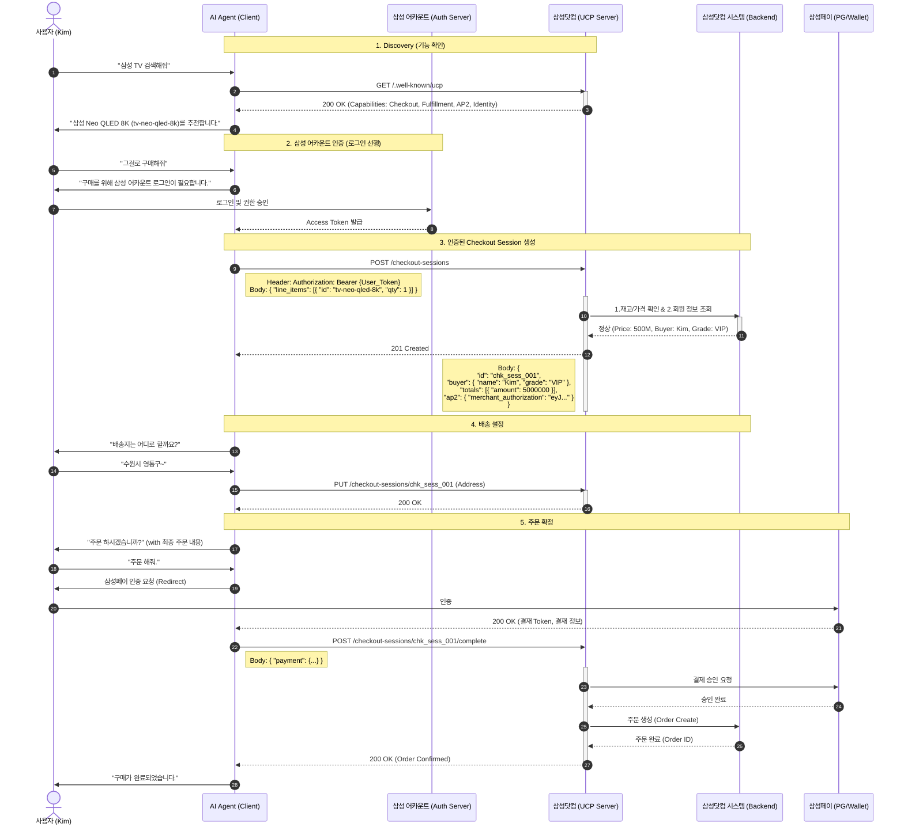

```mermaid
sequenceDiagram
    autonumber
    actor User as 사용자 (Kim)
    participant Client as AI Agent (Client)
    participant Auth as 삼성 어카운트 (Auth Server)
    participant UCP as 삼성닷컴 (UCP Server)
    participant Backend as 삼성닷컴 시스템 (Backend)
    participant PG as 삼성페이 (PG/Wallet)

    %% 1. Discovery
    Note over Client, UCP: 1. Discovery (기능 확인)
    User->>Client: "삼성 TV 검색해줘"
    Client->>UCP: GET /.well-known/ucp
    activate UCP
    UCP-->>Client: 200 OK (Capabilities: Checkout, Fulfillment, AP2, Identity)
    deactivate UCP
    Client->>User: "삼성 Neo QLED 8K (tv-neo-qled-8k)를 추천합니다."

    %% [변경됨] 2. Identity Linking (구매 요청 즉시 인증)
    Note over Client, Auth: 2. 삼성 어카운트 인증 (로그인 선행)
    User->>Client: "그걸로 구매해줘"
    Client->>User: "구매를 위해 삼성 어카운트 로그인이 필요합니다."
    User->>Auth: 로그인 및 권한 승인
    Auth-->>Client: Access Token 발급

    %% [변경됨] 3. Create Authenticated Session
    Note over Client, Backend: 3. 인증된 Checkout Session 생성
    
    Client->>UCP: POST /checkout-sessions
    %% 헤더에 토큰을 실어 보냄
    Note right of Client: Header: Authorization: Bearer {User_Token}<br/>Body: { "line_items": [{ "id": "tv-neo-qled-8k", "qty": 1 }] }
    
    activate UCP
    
    %% [Backend Call] 재고 확인 + 회원 정보 동시 로드
    UCP->>Backend: 1.재고/가격 확인 & 2.회원 정보 조회
    activate Backend
    Backend-->>UCP: 정상 (Price: 500M, Buyer: Kim, Grade: VIP)
    deactivate Backend

    UCP-->>Client: 201 Created
    %% 생성 응답에 이미 Buyer 정보와 서명이 포함됨
    Note left of UCP: Body: {<br/> "id": "chk_sess_001",<br/> "buyer": { "name": "Kim", "grade": "VIP" },<br/> "totals": [{ "amount": 5000000 }],<br/> "ap2": { "merchant_authorization": "eyJ..." }<br/>}
    deactivate UCP

    %% 4. Fulfillment
    Note over Client, Backend: 4. 배송 설정

    Client->>User: "배송지는 어디로 할까요?"
    User->>Client: "수원시 영통구~"
    
    Client->>UCP: PUT /checkout-sessions/chk_sess_001 (Address)
    activate UCP
    UCP-->>Client: 200 OK
    deactivate UCP
    %% 5. Completion
    Note over Client, PG: 5. 주문 확정
    Client->>User: "주문 하시겠습니까?" (with 최종 주문 내용)
    User->>Client: "주문 해줘."
    Client->>User: 삼성페이 인증 요청 (Redirect)
    User->>PG: 인증
    PG-->>Client: 200 OK (결재 Token, 결재 정보)
    Client->>UCP: POST /checkout-sessions/chk_sess_001/complete
    Note right of Client: Body: { "payment": {...} }
    
    activate UCP
    UCP->>PG: 결제 승인 요청
    PG-->>UCP: 승인 완료
    UCP->>Backend: 주문 생성 (Order Create)
    Backend-->>UCP: 주문 완료 (Order ID)
    
    UCP-->>Client: 200 OK (Order Confirmed)
    deactivate UCP

    Client->>User: "구매가 완료되었습니다."
```